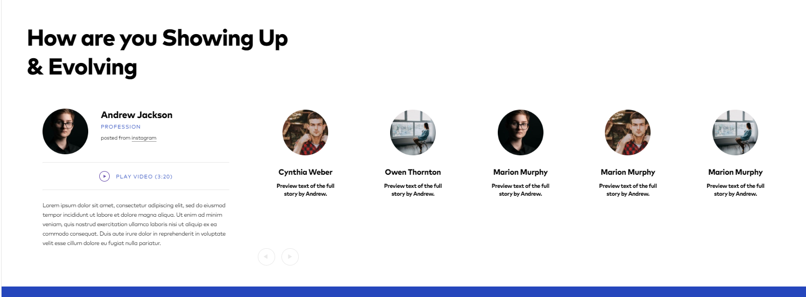
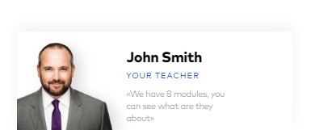
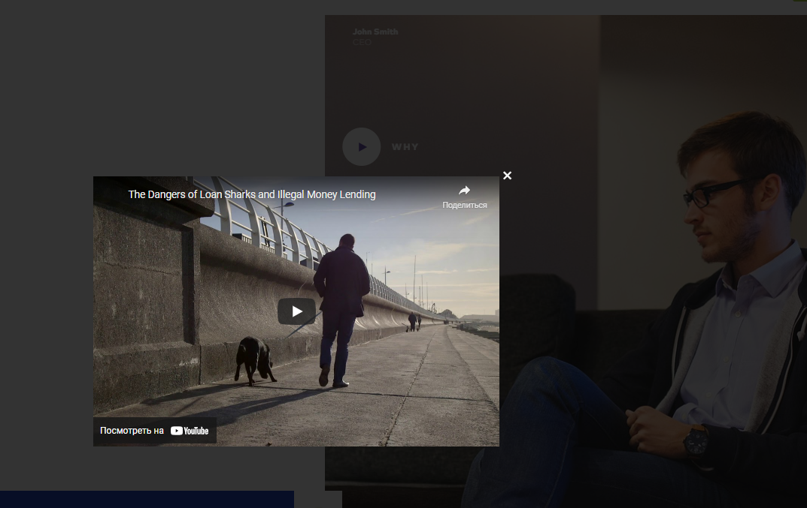
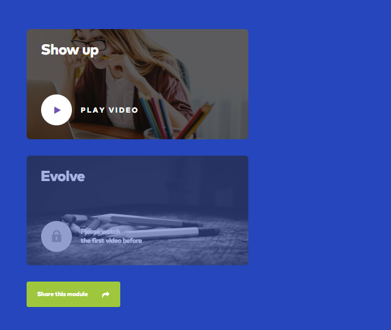
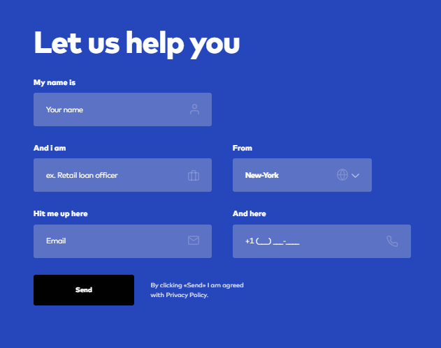
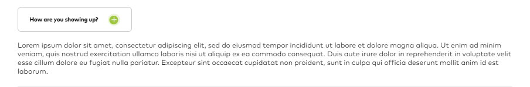
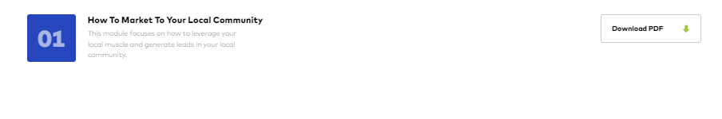

# Portfolio---Loan  
Многостраничный сайт (скрипты в ОПП стиле)  
https://dv-nn.github.io/Portfolio---Loan/  

:white_check_mark: Реализация переключения страниц сайта при клике на стрелку  
:white_check_mark: Создание слайдеров (слайдер на 3 стр. с автоматическим перелистыванием)         
:white_check_mark: Реализация всплывающего со временем блока   
:white_check_mark: Создание видеоплеера в модальном окне (второй видеоролик заблокирован и открывается для просмотра только если человек просмотрел первый ролик)    
:white_check_mark: Реализация формы отправки данных (запрет ввода кириллицы, маска номера, оповещение пользователя)    
:white_check_mark: Создание аккордеона    
:white_check_mark: Реализация скачивания файла при клике   

# Стек:      
- HTML          
- CSS         
- JS         
- Webpack   
- Gulp  
     
# Screenshot:      
     
 
   
      
   
  
      
 
 
  
